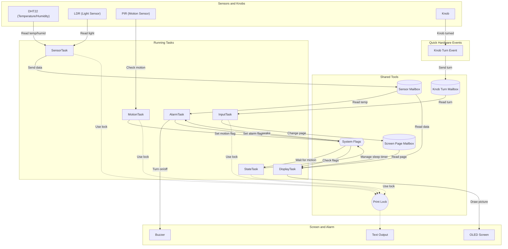

# Real Time Room Monitoring System

A real time room monitoring system built with ESP-IDF and FreeRTOS for the ESP32 chip, simulated on Wokwi.

---

## 1. System Overview
The Room Monitoring System checks indoor temperature, humidity, and light levels. It detects if someone is in the room and turns on a buzzer alarm if the temperature gets too high or too low. It uses FreeRTOS tasks to run smoothly and save power when the room is empty.

---

## 2. Hardware Wiring and Connections

| Part | Component | ESP32 Pin | Connection Type | Setup |
| :--- | :--- | :--- | :--- | :--- |
| Temperature & Humidity | DHT22 | GPIO 4 | Digital Pin | Internal pull-up |
| Light Sensor | Photoresistor (LDR) | GPIO 34 | Analog Pin | Reads values from 0 to 4095 |
| Motion Sensor | PIR Sensor | GPIO 27 | Digital Pin | Pull-down enabled |
| Knob (Turn Signal) | KY-040 (CLK) | GPIO 18 | Interrupt Pin | Reacts to turning |
| Knob (Direction Signal)| KY-040 (DT) | GPIO 19 | Digital Pin | Internal pull-up |
| Knob (Button) | KY-040 (SW) | GPIO 5 | Digital Pin | Internal pull-up |
| Screen | SSD1306 OLED | GPIO 21 (SDA), GPIO 22 (SCL) | I2C | Fast mode |
| Alarm Buzzer | Active Buzzer | GPIO 25 | Digital Pin | Turns on/off |

---

## 3. System Diagram



---

## 4. How the Code Works

1. **Sensor Monitoring (`src/sensors.c`)**:
   - The `SensorTask` reads the temperature, humidity, and light level every 2 seconds.
   - It sends the new readings to the sensor mailbox so other tasks can use them.
2. **Rotary Encoder Controls (`src/input.c`)**:
   - Turning the knob triggers a quick hardware event.
   - It checks which way the rotary encoder is turned and sends a message to the knob mailbox.
   - The `InputTask` changes the screen page when it gets the message.
3. **Screen Display (`src/display.c`)**:
   - Updates the OLED screen 5 times a second.
   - Reads the latest sensor data and current screen page to draw the right information.
4. **Alarm (`src/alarm.c`)**:
   - Checks the temperature: if it is below 18.0 C or above 30.0 C, it turns on the buzzer and sets the alarm flag.
5. **Sleep and Wake State (`src/system_state.c`)**:
   - Manages if the system is awake or asleep.
   - If no one moves in the room for 15 seconds, it turns off the screen and goes to sleep.
   - As soon as the motion sensor sees movement, it wakes up immediately.

---

## 5. Build and Test Instructions

### Run Automated Tests
```bash
~/.platformio/penv/bin/pio test -e native
```

### Build the Code for ESP32
```bash
~/.platformio/penv/bin/pio run -e esp32dev
```

### Check for Code Errors
```bash
~/.platformio/penv/bin/pio check -e esp32dev
```
